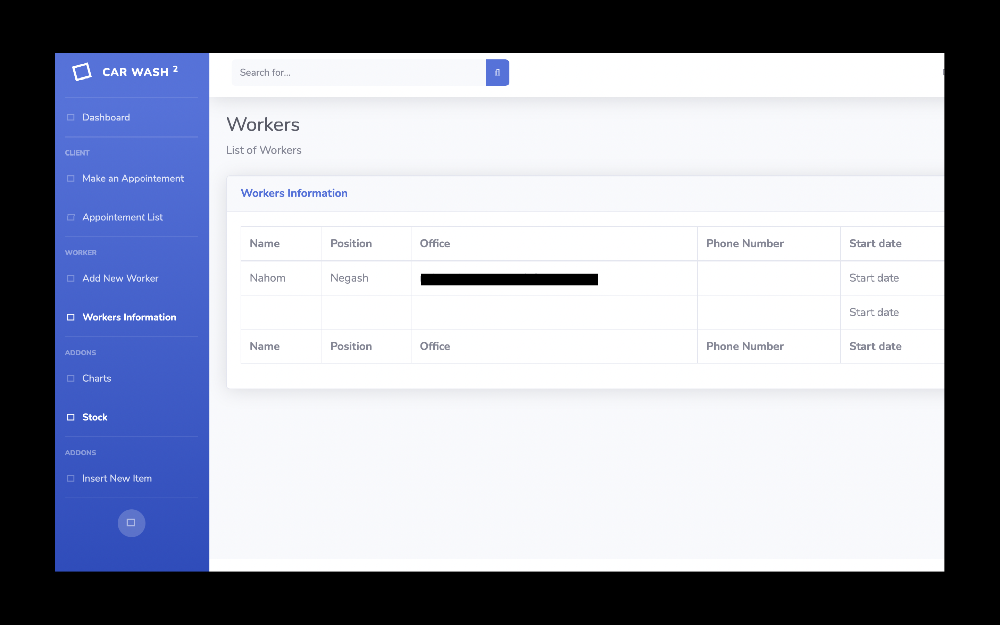

## CAR WASH APP

The purpose of the web app is to help carwash business owners. Furthermore, it helps the owners keep track of the employees and customers that have visited the 
shop. It keeps track of the monthly income of the company and the stock of items in the shop. 

# How the app is built:

The front end of the web app uses bootstrap and HTML. However, I have used javascript to utilize chart.js for analyzing the monthly data collected from the store. Furthermore, the back-end of the app used the Flask framework. Since the app is not ready for deployment yet, I have decided to use FLASK to test and run the app. I am currently using SQLAlquemy to store data, which will also change during deployment.

 
# Client Form

Form to make an appointement and add the customer to the queue. 

# Worker Form

Form to insert a new worker to the station.

# List of Worker

List of workers that are working that date.

